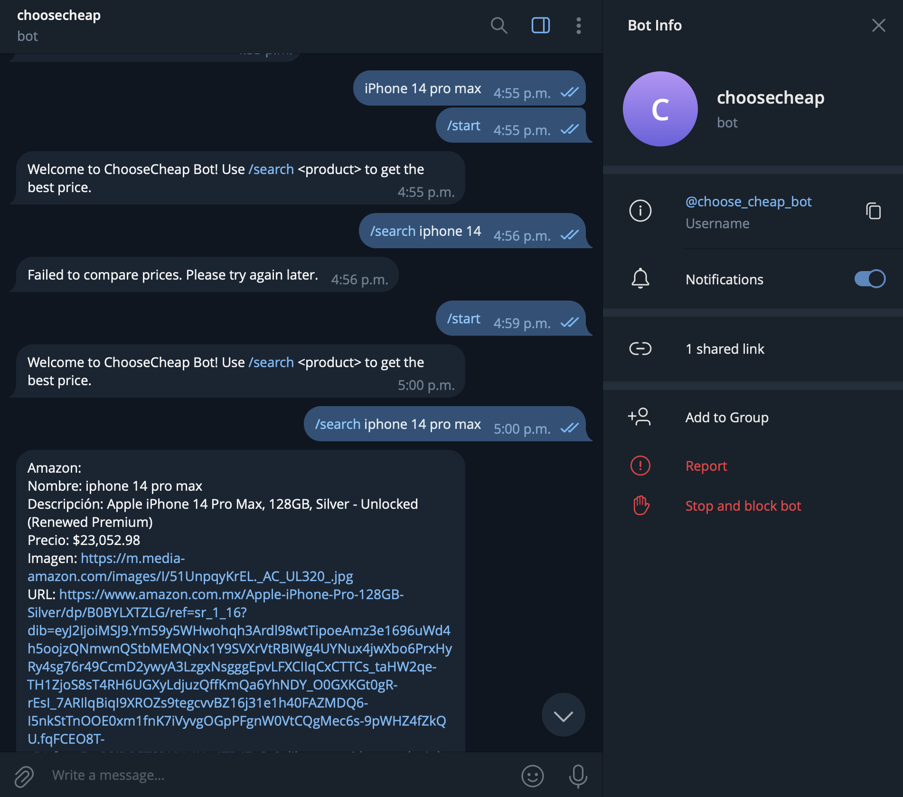

# Telegram Bot Service

## Description
Handles interactions with users on Telegram. It processes commands, forwards requests to the Aggregator Service, and sends responses back to users.

## Installation

### Pre-requisites:
- Telegram Installed
- Typescript
- Docker

```bash
$ npm install
```

## Running the app

```bash
# development
$ npm run start

# watch mode
$ npm run start:dev

# production mode
$ npm run start:prod
```

## Test

```bash
# unit tests
$ npm run test

# e2e tests
$ npm run test:e2e

# test coverage
$ npm run test:cov
```

### Example of usage:

## License

Nest is [MIT licensed](LICENSE).
